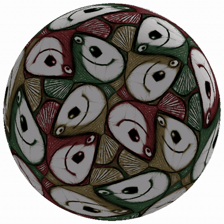
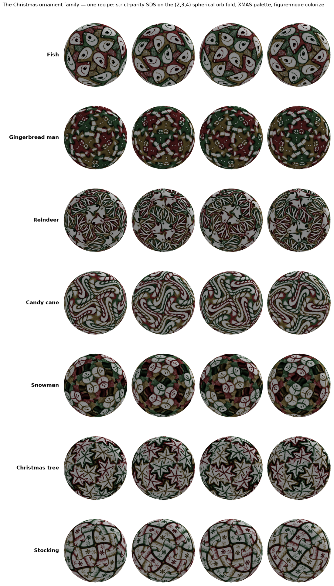

<p align="center">
  
</p>

<h1 align="center">Generative Spherical Orbifold</h1>

<p align="center">
  Escher-style tilings, generated from a text prompt and wrapped seamlessly around a sphere.<br>
  Emilio Sánchez-Harris &amp; <a href="https://github.com/nikhitrivedi1">Nikhil Trivedi</a>, advised by Dr.&nbsp;Crane Chen · 2024–2026
</p>

---

Give it a prompt — `"A professional cartoon of a fish, a masterpiece"` — and it produces a
closed spherical surface tiled with that figure in the style of M.C. Escher: the tile's
**outline is the figure**, every tile interlocking with its neighbours, no gaps and no
overlaps, certified — the tiled mesh's signed solid angles sum to exactly 4π with zero
inverted faces.

Nothing is pasted on. The tile above starts as an **undeformed kite** and a field of
random noise; score distillation sculpts both the outline and the shared texture through
a differentiable spherical orbifold Tutte solve. Diffusion's only role is the score
gradient — no target silhouette, no image anchor, no reference picture anywhere in the
loop.

Built on **[Generative Escher Meshes](https://github.com/thibaultgroueix/GenerativeEscherMeshes)**
(Aigerman &amp; Groueix, SIGGRAPH 2024 — [paper](https://arxiv.org/abs/2309.14564)),
extended from flat wallpaper tilings to closed spherical surfaces using
**[Spherical Orbifold Tutte Embeddings](https://github.com/noamaig/spherical_orbifolds)**
(Aigerman &amp; Lipman, SIGGRAPH 2017), whose MATLAB reference we ported to Python and
modernised — and then validated against the original's converged output to **8.3e-9 per
vertex**.

## The ornament family

Seven subjects, one recipe, one palette, one render treatment. Every sphere below is an
actual output of this code on the octahedral `(2,3,4)` orbifold — 24 tiles — and differs
from its neighbours **only in the text prompt**.

<p align="center">
  
</p>

## How it works

1. **Geometry.** A fundamental domain of a spherical orbifold — a lune for the dihedral
   `(k,2,2)` groups, a kite for the platonic `(2,3,3)`, `(2,3,4)`, `(2,3,5)` groups — is
   embedded on the sphere by an orbifold Tutte solve with the Karcher (geodesic) Dirichlet
   energy, made differentiable via the implicit function theorem (one sparse adjoint solve
   per backward pass). One side of the cut is free and the other is *generated* by the
   symmetry group, so tiles interlock by construction and the four cone points are pinned
   where the rotation axes pierce the sphere.

2. **Joint sculpting.** Shape and texture train **together for the whole 7000-step run**,
   from the undeformed kite. The optimised variable is the *edge weights of the solve*, so
   every gradient step reshapes the entire domain through the embedding rather than
   nudging boundary vertices; the outline articulates instead of smoothing. Score
   distillation drives it at the regime the paper demonstrates — greyscale, guidance 100,
   shape LR 10× texture LR, constant t∼U(0.02, 0.98), texture-drop 50 for pure-outline
   signal. Spherical Tutte has no planar injectivity theorem, so a fold-revert safety net
   watches every step (measured: zero folds and zero reverts across the runs above).

3. **Certification.** Validity is never assumed. Every run ends with the signed-solid-angle
   certificate — total exactly 4π, zero flipped faces, i.e. no gaps and no overlaps — and
   folding steps are projected back to the valid set during optimisation.

4. **Presentation.** The 24 tiles share one greyscale atlas and are recoloured at render
   time by a per-tile matrix along a proper colouring of the tiling's adjacency graph.
   The colouring is *balanced* and **pinwheel-aware**: with four colours no colour repeats
   at any of the 14 rotation centres. The recolour is **luminance-gated** (`COLORIZE_MODE:
   figure`) — near-white texels stay white on every tile, so the ground reads as one
   continuous field and the tile boundaries through it disappear. Colour lands only on
   figure paint, which is the rule Escher's own coloured tilings obey.

## Quickstart

```bash
# environment: conda + CUDA torch + requirements + nvdiffrast built from source.
# (The pins in install.sh predate the environment these results were produced on —
#  torch 2.6 / CUDA 12.4 — but the sequence of steps is current.)
bash install.sh

# 0. one-time: write the undeformed starting state (CPU, seconds)
python escher/sanity_checks/make_identity_checkpoint.py \
    OUT_DIR=runs/r10_parity/prep/carve_identity40 KITE_N=40

# 1. sculpt a sphere from a prompt (GPU, ~70 min: 7000 joint SDS steps)
python escher/main_sphere.py \
    "CONF_FILE=[configs/sphere_texture.yaml,configs/sphere_texture_octa.yaml,configs/sphere_texture_octa_gemfull.yaml,configs/sphere_texture_octa_parity.yaml]" \
    RESUME=runs/r10_parity/prep/carve_identity40/checkpoint.pt START_STEP=0 \
    PROMPT="A professional cartoon of a fish, a masterpiece" \
    OUTPUT_DIR=output/fish

# 2. deliverables: turntable, textured OBJ, contact sheet
python escher/render_final.py output/fish/checkpoint.pt COLORIZE=1 MODE=figure
```

**Batches.** The same chain runs unattended over many prompts and seeds — a two-lane
scheduler overlaps CPU work with the exclusive GPU runs, every stage is its own process
with typed exit codes, and a manifest plus contact sheet record the night:

```bash
python -m escher.pipeline escher/configs/batch_r10_parity.yaml           # the fish
python -m escher.pipeline escher/configs/batch_r18_parity_subjects.yaml  # six ornaments
python -m escher.pipeline escher/configs/batch_smoke.yaml --dry-run      # <1 min check
```

**Comparing looks without retraining.** Colour modes and palettes are render-time, so any
finished checkpoint can be re-presented in seconds:

```bash
python escher/sanity_checks/render_mode_board.py --out board \
    --checkpoints output/fish/checkpoint.pt --palettes xmas,xmas_white --modes flat,figure,ink
```

Configs live in `escher/configs/` (`sphere.yaml` is the base; the rest are phase overlays
and batch specs). The test suite — **408 tests, `python -m pytest tests/`** — runs entirely
on CPU, including the solver's golden-output check and the batch driver end to end.
[`Troubleshooting.md`](Troubleshooting.md) covers the import/`PYTHONPATH` trap, speed
expectations, and what to check before believing a speed theory.

## Results

**The method, at strict paper parity.** Greyscale SDS at guidance 100, 10:1 learning
rates, full-run joint from the undeformed kite with a random texture — the regime the
paper demonstrates, executed on a sphere for the first time. Every tile is a fish with
body, eye and fanned tail fins; perimeter articulated to **1.407×** the undeformed tile;
**zero folds and zero reverts across all 7000 joint steps**; 4π certificate at 2.6e-8.
Config: `sphere_texture_octa_parity.yaml`.

**The solver is validated against the original, not against itself.** The MATLAB reference
was rerun under Octave and its *converged embedding* dumped — not just its inputs. The
Python solver reproduces it to **8.3e-9 max / 3.0e-9 median per vertex**, against a test
gate of 1e-6 (`tests/test_golden_solution.py`, fixtures in `tests/golden/reference_rerun/`). Along the way the port surfaced a reversed L-BFGS
two-loop recursion inherited from the reference — fixing it cut solver iterations by a
third and moved the converged embedding by 5e-11.

**Speed.** The hot path was profiled per phase rather than guessed at. Attention was
already optimal (torch 2.6 dispatches diffusers to FlashAttention-2 through native SDPA);
the real costs were the VAE encoder at 48% of wall clock and the CPU Tutte solve at 22%.
Swapping the encoder for TAESD and rebuilding the solver stack (textbook two-loop order,
memory 8, stale-preconditioner reuse, GMRES-preconditioned adjoint) took a step from
**615 ms to 232 ms — 2.7× — while *doubling* the texture resolution** (256 → 512).
Both figures are the mean over the same 700 steps of a config-matched A/B pair,
`runs/r14_accel/{ctrl,full_512}/tex_s0/timing.csv`.

### What we measured

- **The step budget is real.** At 1400 steps the texture is coloured stipple; the same run
  at 7000 resolves into clean icing, scales and eyes. Nothing before the schedule
  completes predicts the final result — one run was nearly abandoned at step 1100 over
  blobs that turned out to be the prompt's *candy buttons*, still forming.
- **Cotangent initialisation.** Starting the weights mode from *uniform* weights made
  `W = 0` a harmonic distortion of the domain rather than the domain itself — per-face
  areas spread **82×**, which is also the texel-density range and therefore the effective
  per-texel learning-rate range. Referencing the solve instead drops it to **1.4×**.
- **Prompt phrasing is a first-class geometric lever.** Asking for "long arms and legs
  stretched wide" took the worst unpainted corner pocket from 31.75° to 4.75° of arc where
  neither extra geometric freedom nor added context views helped at all.
- **Luminance polarity decides where colour lands.** Under the gated recolour, whichever
  of figure or ground is *darker* takes the tile colour. Describing the decoration in the
  prompt ("a cookie body decorated with white icing buttons") controls that polarity — and
  is what finally made the gingerbread man read as gingerbread.
- **A metric alone is not a verdict.** An arm that scored a *perfect* zero on the
  corner-pocket metric did so by dissolving its figures into generic mass. Every gate in
  this project pairs a number with eyes on the image.

## Current limitations

Thin, elongated subjects resist the equivariance constraint: the candy cane tiles as
handsome cane-hooks rather than a literal candy cane, and the snowman needed its prompt
rephrased as a cookie before it resolved. Curled fish and reptiles tile as the model draws
them; humanoids need their silhouette phrased for tiling. Where a figure genuinely reaches
the tile edge, differently-coloured neighbours still abut — that is the Escher interlock
itself, not an artefact, and no render mode should hide it.

Untried levers: an area-preserving (authalic) rather than harmonic UV, texel-density
normalisation of accumulated texture gradients, and a VSD-style objective. On that last
one — lowering guidance *without* switching objectives fails outright (measured: CFG 12
collapsed the texture to flat stipple). Vanilla SDS needs high guidance to overcome its
own gradient variance; VSD is what makes low CFG viable, so the two must move together.

## What's here

- `escher/OTE/core/spherical/` — Karcher energy with analytic gradients, the projected
  L-BFGS with the reference's two-stage preconditioner schedule, and the implicit
  differentiation layer (validated against finite differences to ~1e-8).
- `escher/OTE/tilings_sphere/` — both orbifold parameterisations for the lune and the
  kite: weights-mode constraint systems and boundary-explicit ones.
- `escher/geometry/` — fundamental-domain meshes, the spherical tiler for all four
  rotation-group families, and the signed-solid-angle certificate.
- `escher/main_sphere.py` — the joint SDS loop: solve, render, distill, step.
- `escher/render_final.py` — turntable, textured OBJ, contact sheet.
- `escher/rendering/palette.py` — the balanced pinwheel-aware colouring and the three
  per-pixel colour modes (`flat`, `figure`, `ink`).
- `escher/pipeline/` — the unattended batch driver (spec → two-lane scheduler → manifest
  + contact sheet).
- `escher/metrics_*.py` — the measurement kit: background fraction, inter-figure murk,
  outline articulation, and the rotation-centre pocket metric.
- `escher/main_shape.py`, `escher/r8_chain.py` — the **deterministic baseline**: a
  silhouette carve and a warped image bake with *zero* score distillation. Kept as the
  ablation the real method is judged against, not as the method.

## Attribution

This is a public mirror of a collaborative research project. The planar tiling machinery
comes from Generative Escher Meshes (see `license.txt` for upstream terms); the spherical
orbifold Tutte formulation follows Aigerman &amp; Lipman's reference implementation. The
spherical extension — the differentiable Karcher solve, the boundary-explicit
parameterisations, the joint-SDS sphere pipeline, the gated presentation layer, and the
certified tiling deliverable — is this project's contribution.
